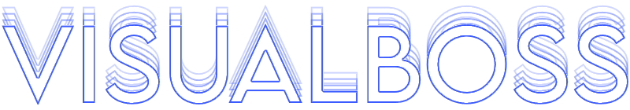

<p align="center">
  
</p>

# VISUALBOSS: PHANTOM FORCES VISUALS LIBRARY
## It's FREE! *and open source *and in extreme development

### Whats visualboss?
- #### Visualboss is a library for phantom forces visuals

# 1.0 IS SOON TO BE DEPRECATED AND THIS PROJECT WILL CHANGE MAJORLY 

### running 1.0 with premade config
```lua
-- EXPECT CHANGES! this is the first release of VIISUALBOSS with no ui or anything special.
getgenv().config = {
    script = {
        ["watermark"] = true
    },

    player = {
        ["gunchams"] = {
            ["color"] = Color3.fromHex('#f517c1'),
            ["transparency"] = 0,
            ["material"] = "ForceField",
            ["overlay"] = "http://www.roblox.com/asset/?id=247707592" -- used to animate forcefield, leave blank if you dont care
        },
        
        ["armchams"] = {
            ["leftarm"] = {
                ["color"] = Color3.fromHex('#0bfff3'),
                ["transparency"] = 0,
                ["material"] = "ForceField",
                ["overlay"] = "http://www.roblox.com/asset/?id=247707592"
            },

            ["rightarm"] = {
                ["color"] = Color3.fromHex('#ffffff'),
                ["transparency"] = 0,
                ["material"] = "ForceField",
                ["overlay"] = "http://www.roblox.com/asset/?id=247707592"
            }
        }
    },

    enemies = {

    },

    world = {
        ["brightness"] = 0,
        ["tint"] = Color3.fromHex('#ffffff'), --// this can change viewmodel colors
        ["saturation"] = 0,
        ["contrast"] = 0,
        ["outdoor_ambient"] = Color3.fromHex('#48c2de'),
        ["ambient"] = Color3.fromHex('#48c2de'),
        ["time"] = 12,

        sky = {["moontextureid"] = "rbxassetid://1345054856", ["skyboxbk"] = "rbxassetid://12635309703", ["skyboxdn"] = "rbxassetid://12635311686", ["skyboxft"] = "rbxassetid://12635312870", ["skyboxlf"] = "rbxassetid://12635313718", ["skyboxrt"] = "rbxassetid://12635315817", ["skyboxup"] = "rbxassetid://12635316856", ["suntextureid"] = "rbxassetid://1345009717"}
    }
}

loadstring(game:HttpGet("https://raw.githubusercontent.com/scotdotwtf/VISUALBOSS/main/source.lua"))()
```

### Assets for your config:

```lua
--[[ GOOD FORCEFIELD OVERLAYS:
    lightning *best one* http://www.roblox.com/asset/?id=247707592
    scratch http://www.roblox.com/asset/?id=6248583558
    dots http://www.roblox.com/asset/?id=6665227233
    water http://www.roblox.com/asset/?id=12734728683
    energy http://www.roblox.com/asset/?id=12734767170
]]

--[[ GOOD SKYBOXES:
    < image >
    -- RedNight
    sky = {["moontextureid"] = "rbxasset://sky/moon.jpg", ["skyboxbk"] = "http://www.roblox.com/Asset/?ID=401664839", ["skyboxdn"] = "http://www.roblox.com/Asset/?ID=401664862", ["skyboxft"] = "http://www.roblox.com/Asset/?ID=401664960", ["skyboxlf"] = "http://www.roblox.com/Asset/?ID=401664881", ["skyboxrt"] = "http://www.roblox.com/Asset/?ID=401664901", ["skyboxup"] = "http://www.roblox.com/Asset/?ID=401664936", ["suntextureid"] = "rbxasset://sky/sun.jpg"}

    -- Sunset
    sky = {["moontextureid"] = "rbxasset://sky/moon.jpg", ["skyboxbk"] = "rbxassetid://323494035", ["skyboxdn"] = "rbxassetid://323494368", ["skyboxft"] = "rbxassetid://323494130", ["skyboxlf"] = "rbxassetid://323494252", ["skyboxrt"] = "rbxassetid://323494067", ["skyboxup"] = "rbxassetid://323493360", ["suntextureid"] = "rbxasset://sky/sun.jpg"}

    -- blue*
    sky = {["moontextureid"] = "rbxasset://sky/moon.jpg", ["skyboxbk"] = "http://www.roblox.com/asset/?version=1&id=135483466", ["skyboxdn"] = "http://www.roblox.com/asset/?version=1&id=135483484", ["skyboxft"] = "http://www.roblox.com/asset/?version=1&id=135483461", ["skyboxlf"] = "http://www.roblox.com/asset/?version=1&id=135483495", ["skyboxrt"] = "http://www.roblox.com/asset/?version=1&id=135483499", ["skyboxup"] = "http://www.roblox.com/asset/?version=1&id=135483475", ["suntextureid"] = "rbxasset://sky/sun.jpg"}

    -- Galaxy
    sky = {["moontextureid"] = "rbxasset://sky/moon.jpg", ["skyboxbk"] = "http://www.roblox.com/asset/?id=159454299", ["skyboxdn"] = "http://www.roblox.com/asset/?id=159454296", ["skyboxft"] = "http://www.roblox.com/asset/?id=159454293", ["skyboxlf"] = "http://www.roblox.com/asset/?id=159454286", ["skyboxrt"] = "http://www.roblox.com/asset/?id=159454300", ["skyboxup"] = "http://www.roblox.com/asset/?id=159454288", ["suntextureid"] = "rbxasset://sky/sun.jpg"}

    -- v a p o r w a v e
    sky = {["moontextureid"] = "", ["skyboxbk"] = "rbxassetid://8631780182", ["skyboxdn"] = "rbxassetid://8631784904", ["skyboxft"] = "rbxassetid://8631769834", ["skyboxlf"] = "rbxassetid://8631777199", ["skyboxrt"] = "rbxassetid://8631735555", ["skyboxup"] = "rbxassetid://8631782345", ["suntextureid"] = ""}

    -- pinkful morning
    sky = {["moontextureid"] = "rbxassetid://1345054856", ["skyboxbk"] = "rbxassetid://12635309703", ["skyboxdn"] = "rbxassetid://12635311686", ["skyboxft"] = "rbxassetid://12635312870", ["skyboxlf"] = "rbxassetid://12635313718", ["skyboxrt"] = "rbxassetid://12635315817", ["skyboxup"] = "rbxassetid://12635316856", ["suntextureid"] = "rbxassetid://1345009717"}

    < gradients >
    -- whitie to purple
    sky = {["moontextureid"] = "", ["skyboxbk"] = "rbxassetid://8107841671", ["skyboxdn"] = "rbxassetid://6444884785", ["skyboxft"] = "rbxassetid://8107841671", ["skyboxlf"] = "rbxassetid://8107841671", ["skyboxrt"] = "rbxassetid://8107841671", ["skyboxup"] = "rbxassetid://8107849791", ["suntextureid"] = ""}

    -- white to pink
    sky = {["moontextureid"] = "", ["skyboxbk"] = "http://www.roblox.com/asset/?id=11427769401", ["skyboxdn"] = "http://www.roblox.com/asset/?id=11427770685", ["skyboxft"] = "http://www.roblox.com/asset/?id=11427769401", ["skyboxlf"] = "http://www.roblox.com/asset/?id=11427769401", ["skyboxrt"] = "http://www.roblox.com/asset/?id=11427769401", ["skyboxup"] = "http://www.roblox.com/asset/?id=11427771954", ["suntextureid"] = ""}    
]]
```
